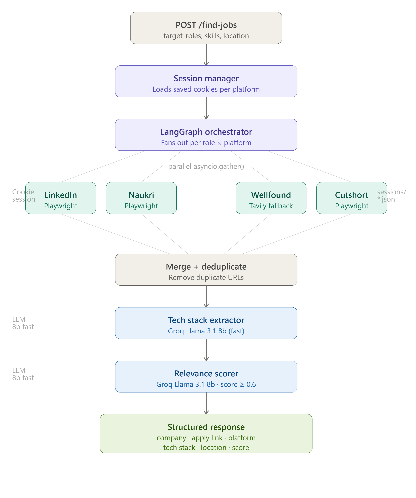

# JobHunterAgent

JobHunterAgent is an AI-assisted automation pipeline that searches jobs across
multiple platforms, scores relevance using LLMs, and attempts applications for
high-confidence matches.

It is built around FastAPI + async Playwright workers, with streaming progress
events so a client can observe each pipeline step in real time.

## What It Does

- Logs in to supported platforms (or reuses cookie sessions)
- Searches jobs across platforms concurrently
- Scores each job against the candidate profile using Groq Llama models
- Keeps only high-relevance jobs (score >= 0.6)
- Attempts applications with per-platform caps
- Generates a markdown report under output/report.md

## Architecture

The runtime follows a multi-step orchestration pipeline:

1. API receives a POST /hunt request with target_roles, skills, and location.
2. Session manager loads platform cookies from sessions/*.json when available.
3. Login agent refreshes sessions for supported platforms.
4. Search agents fan out in parallel using asyncio.gather().
5. Results are merged into a single in-memory job list.
6. Scorer agent uses Groq Llama 3.1 8B Instant to assign relevance scores.
7. Jobs with score >= 0.6 are retained and capped (top 3 per platform) for apply.
8. Apply agent attempts submissions per platform and streams incremental updates.
9. Report agent uses Groq Llama 3.3 70B to generate output/report.md.
10. API streams progress + final payload as Server-Sent Events (SSE).



## Platform Strategy

| Platform | Search Method | Auth Model | Apply Support |
|----------|---------------|------------|---------------|
| LinkedIn | Playwright web automation | Cookie session | Yes |
| Naukri | Playwright web automation | Cookie session | Yes |
| Wellfound | Playwright web automation | Cookie session | Yes |
| Cutshort | Playwright web automation | Cookie session | Yes |
| Instahyre | Playwright web automation | Cookie session / LinkedIn SSO | Yes |

## Repository Layout

core/
- api.py: FastAPI app with health, login-test, login-only, and hunt endpoints
- orchestrator.py: end-to-end async pipeline and SSE event stream
- browser.py: Playwright browser/context/page/session helpers
- schemas.py: request/response/state models
- llm_config.py: Groq model configuration

agents/
- login_agent.py: platform login flows and cookie persistence
- search_agent.py: platform-specific search extractors + search_all orchestrator
- scorer_agent.py: LLM scoring and shortlist filtering
- extractor_agent.py: tech stack extraction utility
- apply_agent.py: platform-specific apply handlers + aggregation
- report_agent.py: markdown report generation

sessions/
- Stored cookie sessions as platform JSON files

output/
- Generated hunt report markdown

## Prerequisites

- Python 3.10+
- Chromium dependencies for Playwright
- A Groq API key
- Platform credentials for websites where login is required

## Installation

1. Create and activate a virtual environment.
2. Install Python dependencies.
3. Install Playwright Chromium.

Example commands:

```bash
python -m venv .venv
.venv\Scripts\activate
pip install -r requirements.txt
playwright install chromium
```

## Environment Configuration

Create a .env file from .env.example and set values.

Required variables for API pipeline:

- GROQ_API_KEY
- LINKEDIN_EMAIL / LINKEDIN_PASSWORD
- NAUKRI_EMAIL / NAUKRI_PASSWORD
- WELLFOUND_EMAIL / WELLFOUND_PASSWORD
- CUTSHORT_EMAIL / CUTSHORT_PASSWORD

Optional / helper variables:

- INSTAHYRE_USE_LINKEDIN=true
- LINKEDIN_CHECKPOINT_TIMEOUT=120

Candidate profile variables in .env.example are mainly used by main.py local flow.

## Session Management

The app stores cookies in sessions/<platform>.json and reuses them on next runs.

Session bootstrap scripts:

- python setup_wellfound_session.py
- python setup_cutshort_session.py

These open a non-headless browser so you can solve CAPTCHA/manual login and save
cookies for future authenticated runs.

## Run The API

```bash
uvicorn core.api:app --host 0.0.0.0 --port 8000 --reload
```

Available endpoints:

- GET /
- GET /health
- GET /login-test
- POST /login-only
- POST /hunt (SSE streaming response)

## Request Contract

POST /hunt expects this JSON body:

```json
{
  "target_roles": ["Python Backend Developer", "Backend Engineer"],
  "skills": ["Python", "FastAPI", "PostgreSQL", "Docker"],
  "location": "Bengaluru"
}
```

## Streaming Response Model

The /hunt endpoint streams SSE events like:

- progress: stage-level status (login/search/scorer/apply/report)
- apply_update: per-job apply outcome updates
- report: markdown report text
- jobs: final structured applied jobs list

## Scoring Logic

- Model: llama-3.1-8b-instant via LangChain Groq
- Output: normalized score between 0.0 and 1.0
- Filter: only jobs with relevance_score >= 0.6
- Ranking: top jobs sorted descending by score
- Apply cap: maximum 3 jobs per platform in orchestrator flow

## Output Artifacts

- output/report.md: final markdown report generated by report agent

## Render Deployment

A render.yaml file is included with:

- Build command: install dependencies + playwright chromium
- Start command: uvicorn core.api:app --host 0.0.0.0 --port $PORT
- Environment variable mappings for credentials and API keys

Deploy by connecting this repository to Render and supplying all required secrets.

## Current Notes

- Browser launch defaults to headless=False in core/browser.py for visibility.
- The /hunt orchestration currently searches all configured platforms in parallel.
- Job deduplication across platforms is not yet globally enforced in search_all.
- The standalone main.py flow uses additional profile fields and may differ from
  API schema-driven execution.